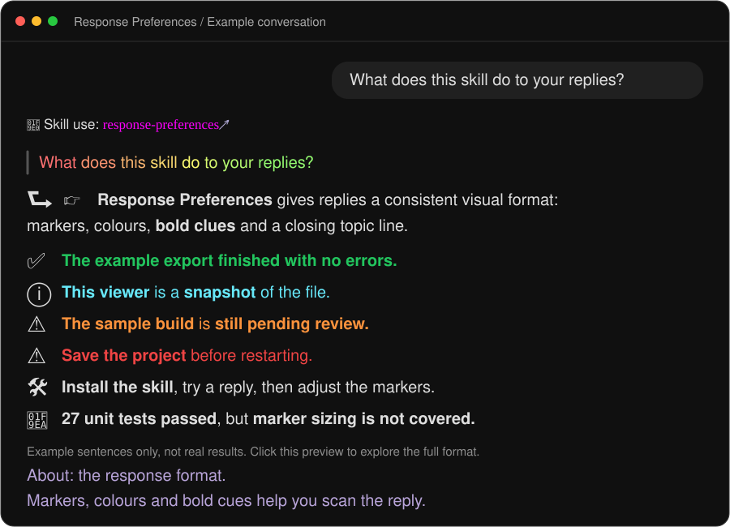

# Response Preferences<br>⮑ 🛠️ 🧪 🖥️ ✅ ❌ 👀 🐌 🐞 ⓘ 👉 🫵 🤨 ⚠️ ❓ 💡 ⚖️ ⛔ 🧠 ➕➕

[](https://ethansk.github.io/response-preferences/)

A personal Codex skill for **how replies are written**. Fixed emoji meanings, coloured highlights, underlined scanning cues, original-message context, and a local Markdown/code editor.

**[Try the website](https://ethansk.github.io/response-preferences/)** · **[Try the editor](https://ethansk.github.io/response-preferences/viewer.html)** · **[Read the skill](SKILL.md)**

Created from Ethan's preferences, shared so you can use or adapt them. The website presents the examples inside a smaller Codex-style window on a macOS desktop: a task sidebar, compact title bar, centered conversation, source/details panel and bottom composer. It is an independent, interactive demonstration—not the Codex app—and does not run an AI.

Six example conversations introduce the skill, guide installation and customisation, explain the response format, demonstrate file/context links, and show successful and failed tasks. Together they demonstrate all 20 global markers, the full colour palette, underlined scanning clues, quoted questions and closing topic reminders. The home chat previews the full range straight away: working and final markers, all 20 meanings, colours, underlines, section carets, tables, file and message links, annotations and optional notification summaries. The guide sits on a macOS Tahoe desktop with Ethan’s app icons and menu-bar apps recovered from his ultrawide reference. Dock icons open each app’s public website; menu-bar app icons open Menu Bar Dock, which supplies the app strip. Hover or focus an icon to see its destination. The **Apps in this setup** directory keeps every app reachable on small screens and links the wallpaper. Personal folders and the local-only media-key helper are omitted. The window has standard macOS traffic lights, reversible preview controls and keyboard-accessible navigation. Click a marker for a compact explanation that keeps the chat in place, or open a file in the working Markdown/code editor. Copy an installation prompt, manual commands or a question for your own agent; this website does not contact a model or install anything itself.

This is a set of agent instructions with helper scripts, not a modification of the Codex app. It cannot guarantee that a model always follows the format.

## What it does

| Feature | Behaviour |
| --- | --- |
| Working versus final replies | Working updates use normal-size markers, including 🧠, and short underlined cues. Final replies use enlarged markers, selected colour and underlined scanning cues. |
| Deterministic markers | Uses a closed vocabulary: the same marker always means the same thing. Only user-approved project mappings may extend it; no arbitrary emoji additions. |
| Meaningful emphasis | Red for critical text, green for confirmed success, orange for warnings, cyan for important information. Every coloured highlight makes sense on its own from its first word, using enough subject and context—even a complete short sentence. Highlight selectively; cyan does not colour a whole information section. |
| Closing topic reminder | Only the final assistant reply ends with a muted-lavender (`#b8a4d9`) `About:` reminder: a brief overall summary, then a second short sentence explaining the specific action, problem or next step for returning readers. It comes after actions and other closing details; the relevant question above each answer stays in place. |
| Sentence scanning | Prefers a short useful underlined clue in working and final prose sentences. A self-contained coloured sentence already serves as a scanning cue. Keeps negatives and conditions so scanning does not change the meaning. Exact quotes, code and links remain intact. |
| Computer Use | 🖥️ for manual browser/app interaction, with explicit status wording. Successful manual tests may use green; automated tests and lint remain ordinary text. |
| Project extensions | Additional user-approved mappings apply only in their project; global meanings stay consistent. |
| Context above answers | Shows the question being answered in a rainbow blockquote above the direct-answer arrow, preserving your wording. One colour per word sits inside short selectable chunks that can wrap; a fixed 24-colour cycle keeps agents from reinventing the format. |
| Original-message links | Opens a document headed **Your message** with the exact original wording and attached images underneath. |
| Clickable references | Links skills, files and specific passages. Colour stays outside the adjacent ↗ link. |
| Markdown viewer | Generates a self-contained HTML page for Markdown links, with source-line mapping and animated passage highlighting. |
| Code editor | CodeMirror provides syntax highlighting, line numbers, search/replace, undo/redo and bracket matching. Preview, edit and split views. |
| Scannable tables | Colours important rows using the existing meanings: cyan for useful highlights, red for critical errors, orange for caveats and green for confirmed success. Underlines key words, keeps routine rows neutral and wording short, and uses approved category markers when helpful. |
| Annotation context | Keeps **Problem at hand**, **Earlier response** and **Your annotation**, then the short rainbow question and answer. These layers work together even in follow-up clarifications; native popups do not replace them. The checker rejects missing labelled context. |
| Notification wording | Defines short, complete notification summaries. Native notification delivery is an optional **separate** integration. |

The response-preference skill itself is used silently. Other skill announcements use 🧠 with a magenta skill name and an adjacent opening link.

## Install

On the [website’s installation walkthrough](https://ethansk.github.io/response-preferences/#setup), choose **Copy installation prompt** and paste it into your Codex task. The prompt asks your agent to check for an existing installation, preserve local edits, add the activation line without duplicating it and demonstrate the installed format. You can also [read the exact prompt](docs/install-prompt.txt) or install manually below.

Requirements: Codex with local skills support and **Python 3.9+** for generated viewers and message-context files. The built viewer is included; no Node installation or build step is needed to use it.

```sh
git clone https://github.com/EthanSK/response-preferences.git ~/.codex/skills/response-preferences
```

Use your configured Codex home instead of `~/.codex` if different. If that destination already exists, preserve it and compare your changes before installing; the clone command deliberately fails rather than replacing it.

Add this instruction to your global or project `AGENTS.md`:

```text
Use $response-preferences for all replies.
```

You can also invoke `$response-preferences` explicitly. Start a fresh task if an already-running task retains earlier instructions. The formatting defaults follow Ethan's choices; edit `SKILL.md` to change them for yourself. LaTeX appearance and file links depend on the chat client's renderer.

When maintaining Ethan’s skill, check the website and README after every response-style change, update affected examples, validate, commit and push to the public repository. Other users should use their own authorised fork. Publishing is part of the same task, without a separate sync request. Compare the installed rules and public checkout before finishing, reconcile shared changes using the latest preferences, and verify the new remote commit and deployment. This is an agent workflow, not a background auto-publisher; private local integrations stay local.

For updates, use `git pull --ff-only` only after reviewing your local edits. Keep personal overrides on your own branch or fork. Do not discard customised preferences to update.

## Marker vocabulary

| Marker | Meaning | Marker | Meaning |
| --- | --- | --- | --- |
| ⮑ | Direct answer | ⓘ | Information |
| ✅ | Confirmed success | ❌ | Failure |
| 👀 | Starting an inspection | 🐌 | Work actively in progress |
| 🐞 | An actual bug | 🫵 | Your action or decision |
| 🤨 | Unexpected behaviour | ⚠️ | Caution |
| ❓ | Missing information | 💡 | Recommendation |
| ⚖️ | Trade-offs | ⛔ | External blocker |
| 🧠 | Skill use | ➕➕ | Added beyond your request |
| 🖥️ | Computer Use and manual browser/app tests | 👉 | Main takeaway |
| 🛠️ | Planning and brainstorming | 🧪 | Tests |

Test-related information uses **🧪**: setup, coverage, progress, results and limitations. State the actual status in words; the icon does not mean a test passed. Automated results remain uncoloured. **🖥️** still marks actual Computer Use/manual browser or app tests, and **🐞** still reports actual bugs.

Planning and brainstorming share **🛠️**: exploring options, proposing an approach and outlining next steps. Use it instead of information for plans; **🐌** remains execution underway and **💡** remains a recommendation. For example: `🛠️ Install the skill, try it on a real reply, then change the markers to suit you.`

Markers stay inline for a single line or short statement. For sections spanning multiple paragraphs or blocks, they sit above the content with a visible ⌄ chevron beside them and apply until the next marker. Start a new marked section when the purpose changes, such as from a successful result to supporting information. Table-cell labels remain inline. The caret points toward the section below; it is a visual cue, not a dropdown control or a new emoji meaning. In the final reply, write `\(\huge\text{ⓘ}\) \(\raisebox{0.3em}{\Large\text{⌄}}\)`: keep the emoji at lowercase `\huge` and use `\Large` for the smaller chevron and raise it `0.3em` toward the emoji’s vertical centre. Do not use the old tiny `▾` triangle or mathematical `∨`. Inline and table-cell markers have no caret. Working commentary uses plain Unicode markers at normal text size, including `🧠 **Skill use:**`; a standalone working section uses `ⓘ ⌄`. Final replies use inline LaTeX with lowercase `\huge`; prose and table-cell labels stay normal size. ↗ is a link-opening control, not another section marker. Reminders use a blockquote with a vertical line on the left; answers stay outside it. The return arrow stays on the same line as the opening answer, even when a table, list, code block or further paragraph follows. It has no caret. Answers name the actual subjects and make sense even when the reminder is skipped.

Read each highlighted clause or sentence on its own: it should make sense without the uncoloured words before or after it. This applies to all four highlight colours; magenta skill names keep their separate name-only styling.

Codex treats each inline LaTeX expression as an unbreakable box. Ethan verified continuous selection in one coloured expression, then showed that whole-paragraph boxes still overflow. Underlines did not give him the triple-click grouping he wanted. The earlier red commands came from missing closing braces or math delimiters, not from an invalid sans-serif/underline combination: in the affected task, all 13 with words after the underline were balanced; all three ending immediately after it omitted the outer closing brace. The authoring pattern is now the simpler short `\underline{\text{...}}` cue, without a nested font command. Colour and About keep `\textsf` in separate short expressions. Keep each expression below 64 approximate visible characters. The generated rainbow question is a separate helper-produced exception.

Keep literal names such as `C#` and `sample_tool` in ordinary text or inline code, with short underlined scanning cues nearby. Write percentages outside the LaTeX box too. If they must be coloured, escape the text as `C\#`, `sample\_tool`, `54\%` or `A \& B`. This applies to coloured text and About reminders.

Start with the [copyable colour patterns](SKILL.md#copy-these-exact-colour-patterns): a cue uses `\(\underline{\text{short clue}}\)`, colour uses `\(\textsf{\color{#67e8f9}A complete short fact.}\)`, and About uses the same simple form in lavender. The checker remains an optional diagnostic for tricky expressions or skill maintenance. It validates syntax with bundled KaTeX but cannot guarantee agent obedience or the app’s layout. Annotation replies still require their labelled context, rainbow question and native reference. Automatic reply repair is not used.

Selected final highlights use `\textsf{\color{#hex}...}` with red `#ef4444`, green `#22c55e`, orange `#fb923c`, or cyan `#67e8f9`. Skill names use upright serif magenta as a deliberate exception. Colours appear outside links because some Codex renderers expose raw LaTeX when it is used as a link label.

Use cyan selectively for **useful explanations of what changed or how the resulting system behaves**, including the main explanation in an opening direct answer after ⮑ or 👉. For example, “Both Playlist types share one visual row” is cyan; “The clipping bug is fixed” is an explicit confirmed success statement and is green. A completion reply does not make every descriptive sentence green. Keep each highlight short and understandable on its own.

Final successful completion statements use green, including **committed, merged, saved and deployed**. Colour the short confirmed outcome itself, not only its tick. Automated test results, lint and other routine automated checks do not get green text. Successful manual tests can use green with 🖥️; failed or incomplete manual tests state that outcome without green. The computer marker takes precedence over generic progress/result markers in Computer Use sections.

Projects can list additional user-approved emoji meanings in their existing instructions. Apply only the relevant project’s mappings; do not invent any or override global meanings without explicit approval. Pass approved extra symbols to the reply checker with repeatable `--approved-project-marker` flags. 🖥️ is global.

## Underlines for scanning

Prefer a short underlined clue in working and final prose sentences: the subject, action, result or qualification that gives away their meaning at a glance. A self-contained coloured sentence already serves as a scanning cue. Make the first underlined clue in a paragraph name its concrete subject. Keep crucial negatives or limits, such as `\(\underline{\text{not uploaded}}\)` or `\(\underline{\text{after restarting}}\)`. Avoid filler and whole-sentence underlining. Exact quotations, code, paths and link labels stay intact.

Write the surrounding sentence as ordinary Markdown. For example: `The backup is \(\underline{\text{not uploaded}}\).` or `The \(\underline{\text{review needs a project}}\) written in` `C#`. Colour highlights use a separate short expression; keep both forms short and fully closed. The website displays underlined cues; never paste raw `<u>` tags into an assistant reply.

## Generate a viewer

```sh
python3 ~/.codex/skills/response-preferences/scripts/create-viewer.py /absolute/path/to/document.md --line 45
```

The command prints the generated HTML path. Link that file in a reply using an absolute Markdown file link. The requested line is embedded into the page; `#L45` also works inside browsers. The same command accepts source code and other UTF-8 text files.

Use `--output /absolute/new-viewer.html` for an explicit destination. Existing explicit outputs are never overwritten. Default outputs are cached by content/template/line under `~/.codex/outputs/viewers/` (or `$CODEX_HOME/outputs/viewers/`). Regenerate after changing the source. The page is a snapshot, not a live file watcher.

For original-message context, create JSON containing `text` and optional `images` (absolute paths), then run:

```sh
python3 scripts/create-reply-context.py /absolute/message.json /absolute/new-context.md
python3 scripts/create-viewer.py /absolute/new-context.md
```

The context helper preserves exact message text and copies available attachments so temporary clipboard paths can expire without breaking earlier links. Keep context and generated viewers for the task's lifetime.

## Editing and privacy

- The viewer is a compact utility: file name and save state in the header, a Preview / Edit / Split control, a line field, icon actions (Search, Open file, Save, Download copy, Light / dark; each names itself in a tooltip and to assistive technology), and a status bar at the bottom for messages. The theme starts from the system appearance; the toggle switches it.
- **Download copy** exports the edited source. It does not overwrite the original.
- **Open file** lets you choose a file on disk. Browsers supporting the File System Access API can then enable **Save** for that picked file. Otherwise, download the copy.
- Saving checks for external edits first and refuses a conflicting write. This is not an atomic lock against other applications; use a copy for files being edited concurrently.
- Unsaved edits get an indicator and navigation warning. Browser policies can suppress unload prompts; save or download before closing.
- Files remain in the browser. The viewer has no server, analytics, remote scripts or upload endpoint. Markdown HTML is escaped, and remote images do not load.
- A generated HTML file **contains its document text and any embedded images**. Keep it private when its source is private. `--public` removes local image/link embeddings; it does not redact the source text.
- Text is limited to 5 MB. PNG/JPEG/GIF/WebP images can be embedded up to 20 MB each, 40 MB total. Complex image destinations and local links are best effort. Linked Markdown trees are not recursively copied.
- The editor highlights Markdown, JavaScript/TypeScript/JSX, Python, JSON, HTML, CSS, SQL, YAML, shell, Rust and Go. Other text opens without language-specific highlighting. There is no code execution, terminal or language server.

See [viewer instructions](references/viewer.md) for details. User clicks and automated browser access have separate permissions: an automation restriction does not mean a local link is broken.

## Optional notifications

Notifications lead with a short version of your request, in your wording and perspective. The text below pairs the status icon with a brief answer summary. Titles contain no emoji; the status icon starts the answer below. The native integration measures one title line and two answer lines before accepting the text. There is no universal macOS character count that guarantees a fit. Metadata stays out of chat. This repository does **not** install notification hooks, a native sender, task routing, or display-duration changes. On Ethan's Mac those are provided by a separate `macos-heads-up-notification` integration. Without it, the agent skips notification preparation. All other features work independently.

## Keeping the format consistent

The everyday pattern is deliberately small: write normal Markdown, use `\(\underline{\text{a useful clue}}\)` in working and final prose, and use `\(\textsf{\color{#67e8f9}A complete short fact.}\)` for a selected colour highlight. Leave surrounding prose, links, code and technical names in Markdown so they wrap naturally. Keep `\textsf` in separate colour and About expressions, never inside or around an underline. The final `About:` reminder and generated rainbow question retain their own fixed patterns.

The bundled checker remains available when diagnosing a tricky expression or maintaining the skill:

```sh
python3 ~/.codex/skills/response-preferences/scripts/check-reply.py /absolute/reply.md
```

It checks mechanical syntax and some structural rules. It is not a required action before every reply, nor proof that the app rendered the message correctly. The earlier brace error was caught by the checker when tested later; the assistant had not checked that outgoing reply. The skill therefore reduces the amount of LaTeX the agent writes rather than depending on a check it might skip. See [verification and coverage](references/verification.md).

GitHub Actions runs the test suite on every push and pull request, including regression cases for the reply checker and the website's marker, colour, quote and skill-link presentation.

The always-read skill is a compact core; [the detailed reference](references/style-reference.md) retains the complete preferences. Read the core separately and retrieve missing ranges if a tool truncates it. Refresh it after compaction or a style correction.

Automatic reply repair is not part of this workflow. Follow the simple complete patterns; use the draft checker only when a diagnostic helps. The old guard and exemption helpers were removed; do not add a completion-hook repair or wake another task to fix formatting.

## Develop

Node.js 22+ and Python 3.9+:

```sh
npm ci
npm run check
```

`src/` holds the editor, styles and HTML shell. `npm run build` produces the self-contained `assets/viewer.html` template. Tests cover source preservation, Markdown line mapping, active-content rejection, generator boundaries, and editor interaction/state.

The simple public site is in `docs/`, served by GitHub Pages from `main:/docs`. Rebuild public demos with `python3 scripts/build-demos.py` after changing the skill or viewer. Public examples are synthetic; never add actual conversations, clipboard images, home-directory paths or generated private viewers to this repo.

## Licence and dependencies

MIT. CodeMirror, markdown-it, Highlight.js and their dependencies retain their own MIT licences. The included bundle contains third-party code; see [THIRD-PARTY-NOTICES.md](THIRD-PARTY-NOTICES.md). This project is independent of OpenAI and is not an official Codex feature.

## Weekly update checks

The agent checks the configured public source on first skill use when a week has passed, using a shared local lease to avoid duplicate checks. When an update is available, it explains the changes and asks if you want it first. It installs only after you agree, preserves local edits and respects opt-outs. Declining or ignoring the offer leaves your installed skill unchanged. No background process is installed. Python 3 is needed for the date/lease helper; the skill can still be used without it. Copied installations need a trustworthy installation baseline; plugin installations use their host updater. See [the update procedure](references/public-updates.md).

## A pointer in the final reply

Only the final reply includes an attention finger: normally one, leaning towards 🫵 when something is needed from you or it is your turn next, and towards 👉 when it is mainly “here is the main information”. These are preferences to guide the choice, not absolute rules. Two may help for distinct important items. Working commentary and progress updates have no attention fingers, so they do not steal your focus. Keep the finger beside its content, not isolated at the bottom. Other status markers keep their meanings.

Only the final assistant reply closes with an About reminder; working updates have none. The reminder uses two short sentences: a brief overall summary, then more specific context to remind you exactly what we are doing. For example: **About: fixing the video export. Restart the app, then retry the clip.** The second sentence adds the action, problem, result or next step instead of repeating the overview. Keep it concise, but let it wrap rather than squeezing it into one line.

Use short selectable lavender chunks when needed: `\(\textsf{\color{#b8a4d9}About: fixing video export.}\) \(\textsf{\color{#b8a4d9}Restart the app, then retry the clip.}\)`. Keep each chunk within the 64-character guardrail and separate chunks with ordinary spaces. Muted lavender is reserved for this one closing reminder, with one `About:` prefix and no extra emoji, bold or divider. The relevant first-person quote remains above its answer; the reminder stays last after any outstanding-item recommendation or applicable environment details.

Closing outstanding-item recommendations include a hover-only ↗ whose destination text gives the fuller explanation; it is deliberately not a working file link. Env footers are reserved for AIMVS work, not unrelated tasks.

## Original-message hover

Prefer Codex’s native `:codex-annotation{index="N"}` reference for an actual attached response annotation. It shows the selected text and the user’s comment on hover, so no fake file-path link is needed for that annotation. Its index must point to an annotation supplied with the message; it cannot be used to attach arbitrary message text. The ordinary-message fallback below remains useful when there is no supported native reference.

The quoted question can use `[↗](</Original user text here>)` to show the original text in Codex’s destination popup. This user-confirmed short-text technique includes a leading slash and is hover-only: clicking does not open a file. Keep a separate real context-viewer link for attached images or clickable context. Long messages, line breaks and special characters are not yet verified.

The example sidebar includes a [numbered separator chat](https://ethansk.github.io/response-preferences/#separator), showing how Ethan uses a pinned task with a dashed name to visually separate groups of chats.

## Rainbow question reminders

The short quoted question above each answer uses a fixed 24-colour cycle, including pink between violet and red. These colours identify your words; status highlights in the answer retain their own meanings. Each new quote starts one position further along that fixed cycle. The helper advances a small shared local counter, wrapping after 24; a lock protects simultaneous tasks. The counter stays outside the public skill, and retries reuse the same generated quote. Every word advances one colour; longer quotes repeat the cycle after 24 words without restarting at line wraps. Separate expressions allow wrapping, and code or links keep their normal behaviour. Full annotation/evidence blocks remain unchanged.

[Copy the exact recipes and different-length examples](references/format-recipes.md), or run `python3 scripts/rainbow-quote.py question-1.txt question-2.txt` to generate renderer-checked blockquotes from one or more plain-text excerpts. Multiple files are handled in one process and receive consecutive starting colours. The recipes also settle recurring choices for success versus information, test results, final pointers, punctuation and About reminders.
